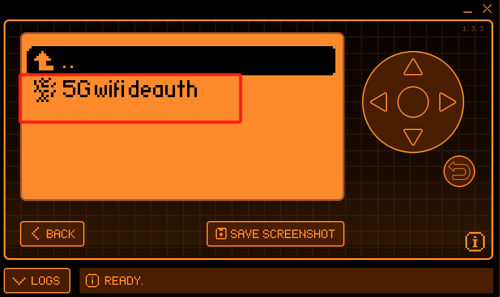
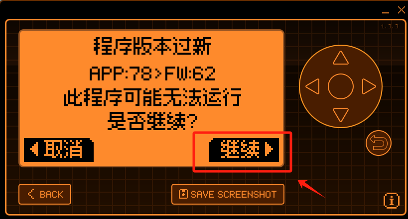
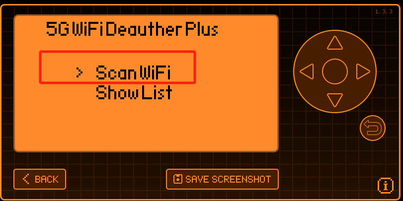
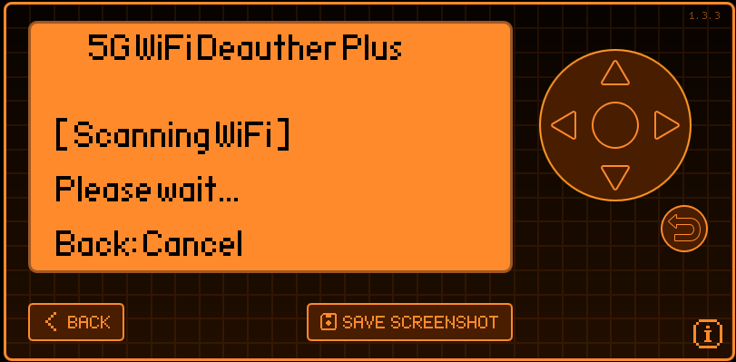
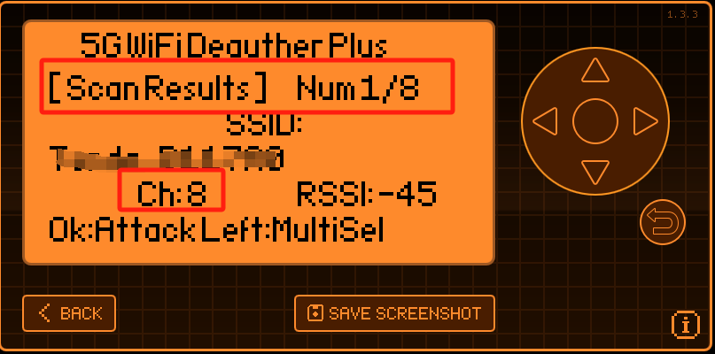
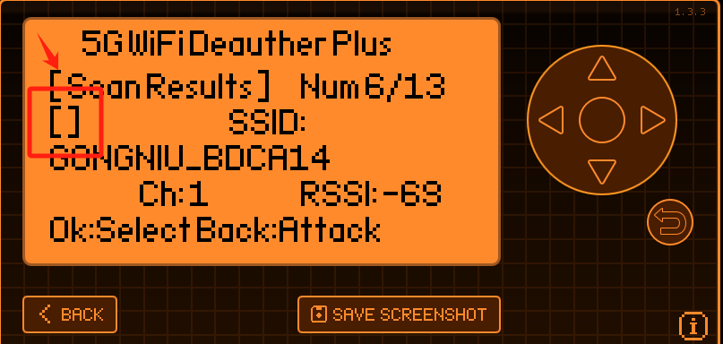
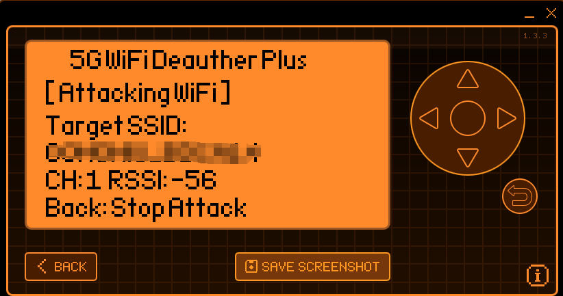

# Flipper Zero 2.4/5Ghz WiFi DeautherPlus

## Ссылка для загрузки прошивки

[FAP File](https://github.com/yanjinbib/Product-information/tree/main/HF-K-108-A-0-Y/FAP)

## Инструкция по использованию

1.При помещении файлов Fap в устройство Flipper Zero, вы можете создать свою папку в каталоге App для хранения файлов.

2.Соедините вывод VCC модуля с 9-м контактом Flipper Zero, а вывод TX модуля — с 14-м контактом, затем вставьте модуль в Flipper Zero в правильной ориентации. В этот момент загорание LED2 указывает на то, что модуль включен и работает, а загорание LED3 означает успешное обнаружение WiFi.

3.Нажмите на «5G WiFi Deauth». Если появится сообщение о том, что версия слишком новая, нажмите «Продолжить», чтобы пропустить уведомление.

4.Нажмите «Поиск WiFi», чтобы начать сканирование ближайших WiFi-сетей.

5.Если канал (ch) больше или равен 36, то это сигнал 5G. Данное расширение поддерживает тестирование безопасности WiFi-сигналов на частотах 2.4 ГГц и 5 ГГц. Используйте клавиши вверх и вниз для просмотра найденных сигналов, а кнопку OK — для запуска тестирования безопасности.

6.При тестировании безопасности нескольких WiFi-сетей нажмите левую кнопку, чтобы появились флажки. Используйте клавиши вверх и вниз для прокрутки, затем нажмите OK, чтобы выбрать несколько WiFi-сетей. После выбора нужных WiFi-сетей нажмите кнопку возврата, и загорится светодиод LED1, что означает начало тестирования.

