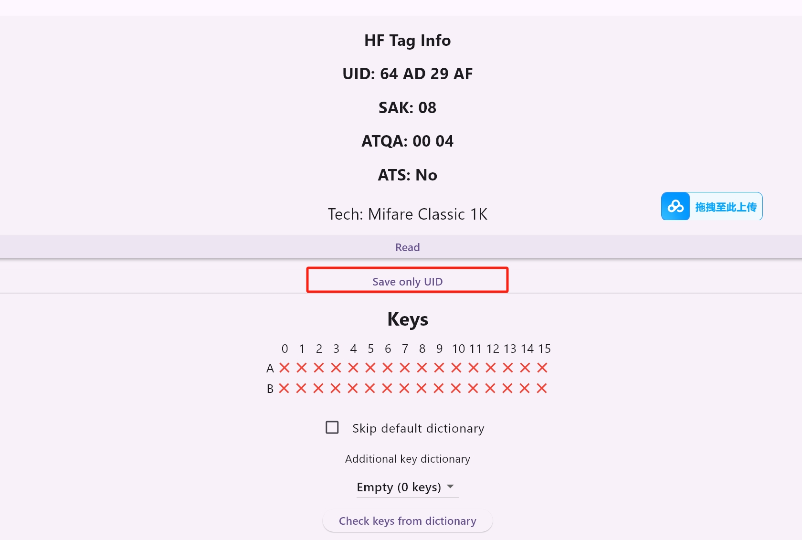
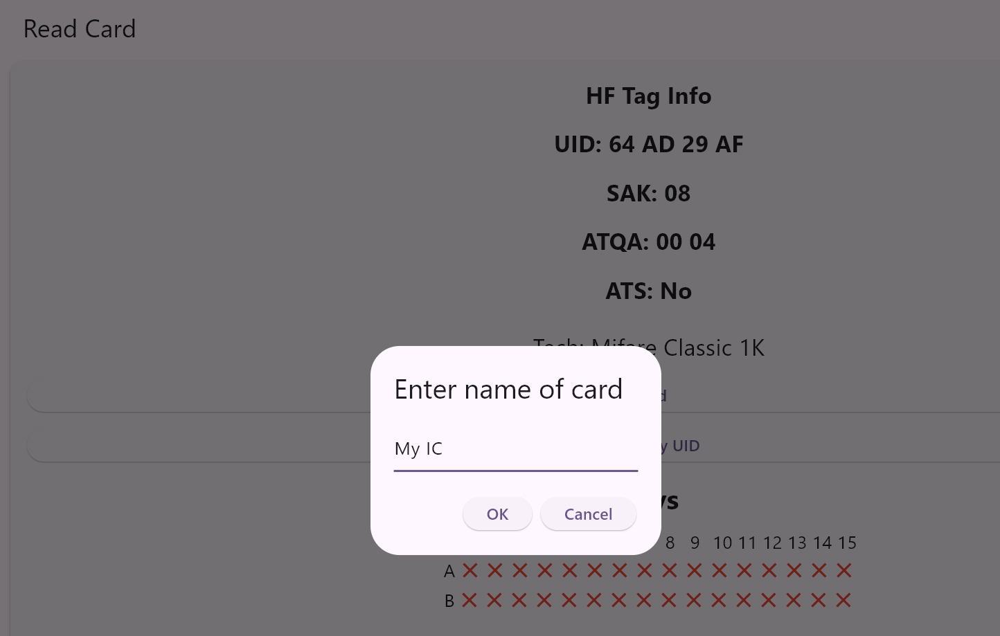
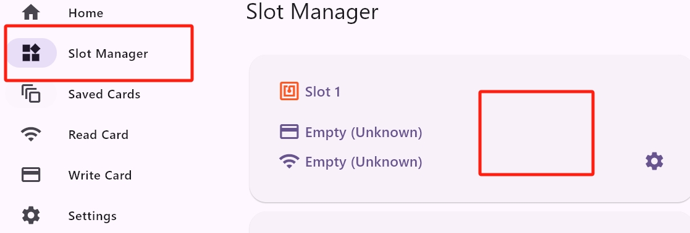
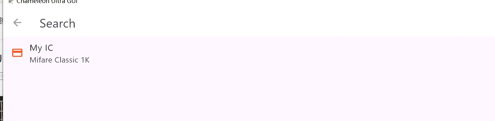
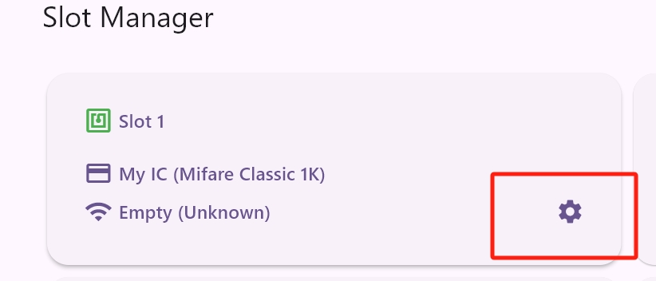
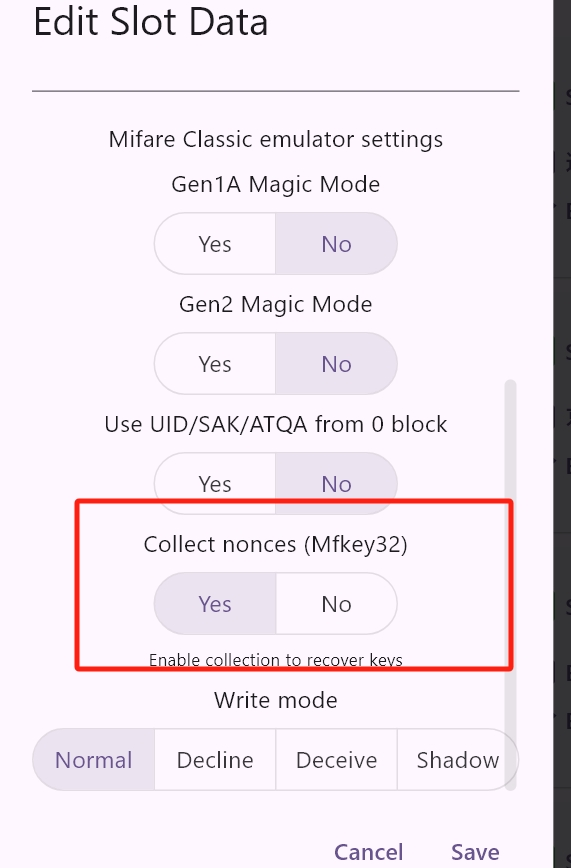
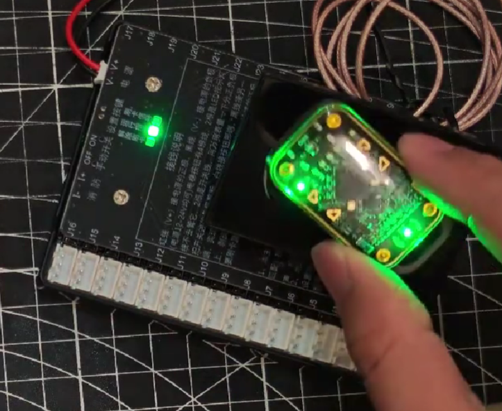
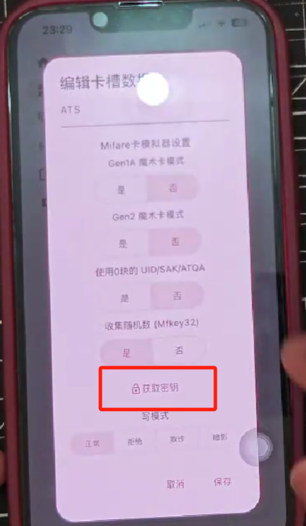
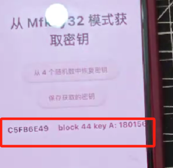
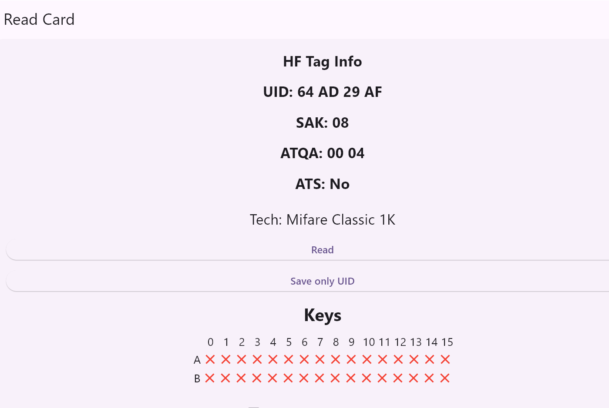

 

# Учебное пособие по сниффингу с использованием Chameleon

## Предварительные условия

1. Карта доступа, которую необходимо расшифровать

2. Устройство Chameleon

## Принцип работы

Ключи карты хранятся не только в самой карте, но и в считывателе. Копируя идентификатор карты (UID), мы имитируем легитимную карту для коммуникации со считывателем и получения ключей.

## Шаги сниффинга

1.В качестве примера возьмём IC-карту. Считайте карту, которую нужно взломать, и нажмите "Сохранить UID".

2.Добавьте карту для взлома в соответствующий слот.

3.Нажмите "Настройки", активируйте "Сбор случайных чисел" и сохраните настройки.

4.Переключите Chameleon на соответствующий слот и поднесите к считывателю 3-4 раза.

5.Снова откройте настройки слота - под опцией "Сбор случайных чисел" появится возможность получить ключи.

6.Нажмите "Получить ключи", затем "Получить ключи из случайных чисел" для начала расшифровки.

7.Расшифрованные ключи появятся на экране. Вы можете сохранить их в нужный словарь.

8.Снова считайте карту, выберите словарь с сохранёнными ключами и нажмите "Проверить ключи из словаря" для успешного взлома карты.

9.Сохраните расшифрованную карту в любой слот для дальнейшего использования.
